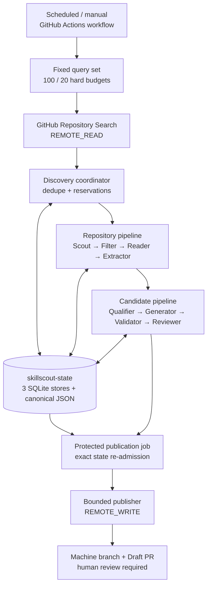

# SkillScout Architecture

## System overview

SkillScout is a modular, resumable pipeline that periodically searches public GitHub repositories with a fixed, reviewed query set, admits at most 100 repositories for deterministic processing, and grants semantic-stage reservations to at most 20 candidates. It turns each bounded, read-only repository view into an evidence-backed Agent Skill candidate and, only after deterministic qualification, validation, independent semantic review, and protected re-admission, may create or update a Draft Pull Request in a controlled catalog. The implementation follows a domain/application/adapter structure: immutable Pydantic contracts and pure policy live in `src/skillscout/domain/`, orchestration lives in `src/skillscout/application/`, concrete GitHub, semantic-provider, filesystem, validator, SQLite, and state-branch integrations live in `src/skillscout/adapters/`, and `src/skillscout/bootstrap.py` plus `src/skillscout/cli.py` are the composition and command boundaries.

The normal path never clones a source repository, installs its dependencies, imports its modules, or executes its scripts. Remote source access is through a closed GitHub REST read adapter; repository bytes are treated as untrusted data. Publication is a separate authority-bearing subsystem whose terminal automated action is a Draft PR and reviewer request. No production interface exposes merge, approval, review submission, ready-for-review, default-branch mutation, or arbitrary HTTP operations.

## Component diagram



The diagram shows authority direction, not a single in-memory call graph. Discovery, semantic processing, and publication remain separate application graphs. State transitions are exported to the dedicated `skillscout-state` branch and acknowledged only after compare-and-swap update plus a complete remote re-read. The protected publication job then re-reads the exact state commit and re-derives every admission before minting the catalog-scoped GitHub App token.

## Pipeline and data flow

1. `.github/workflows/discover.yml` starts on the fixed daily cron `17 3 * * *` or by manual dispatch. Its production concurrency group is `skillscout-production`, with active runs never cancelled.
2. `DiscoveryQuerySetV1` admits exactly four reviewed GitHub Repository Search queries from `config/discovery-queries-v1.json`. Search uses 25 results per page, at most four pages per query, round-robin acquisition, and deterministic first-seen deduplication.
3. Deterministic reservations enforce hard ceilings of 100 discovered repositories and 20 semantic candidates. These literal limits are enforced in the domain contracts, operations ledger, and application coordinator rather than delegated to workflow configuration or the model.
4. For each admitted repository, `Scout` reads metadata, resolves an exact 40-character commit SHA, and enumerates a bounded tree. `Filter` applies the closed repository and license policy, and `Reader` rejects symlinks, submodules, binary/LFS, disallowed paths, and over-budget content.
5. `Extractor` sends a delimited untrusted snapshot to a tool-less structured semantic request. Deterministic code verifies cited paths, blob SHAs, verbatim excerpts, content hashes, and forbidden-text rules before constructing at most three canonical `WorkflowSpec` objects.
6. Candidate processing reopens the completed repository evidence read-only, verifies its hash chain and authority, then executes `Qualifier`, `Generator`, `Validator`, and an independent `Reviewer`. Failures and negative decisions become terminal local outcomes without publication authority.
7. After each authority-bearing reservation or semantic transition, the pipeline, operations, and publication stores export canonical SQLite-plus-JSON state. `StateBranchStore` compares the observed `skillscout-state` head, performs a non-force ref update, and fully restores the new commit before issuing a durability receipt.
8. The discovery job hands the protected job only the run ID, exact state root and commit, and bounded eligible-candidate locators and digests. It does not hand over publication admission or catalog credentials.
9. The protected job re-reads the exact state commit and independently re-derives every candidate admission. Only after that comparison succeeds does the workflow mint a catalog-scoped GitHub App installation token.
10. `publish-discovered` runs each independently admitted candidate through the bounded publication application. `GitHubPublishClient` reconciles the catalog, derived machine branch, marker, lineage, package tree, and reviewers, then uses the pull-request creation endpoint with `draft: true`; no automated path merges, approves, or marks a PR ready for review.

The older `dry-run` command exercises a fixture profile over the complete `PipelineStage` spine, ending in a local `PublicationPlan` with status `planned_not_published`. It is not the controlled remote publisher. The implemented repository profile ends after the Phase 2 extractor, Phase 3 has its own four-stage ledger, and remote publication has a separate state machine.

## Stage contracts and the `WorkflowSpec` boundary

All persisted cross-stage objects use strict, frozen Pydantic models with unknown fields forbidden. Canonical JSON and SHA-256 digests bind identities, payloads, results, checkpoints, manifests, model/prompt/policy versions, retry policy, and source commit. Stage payloads also enforce limits on JSON depth, node count, collection size, key size, string size, integer range, and total manifest bytes.

`WorkflowSpec` is the main untrusted-content reduction boundary:

- Before the boundary, the reader holds bounded repository text and the extractor receives it as explicitly untrusted inert data.
- The model can propose workflows only through `ExtractorResponse`; it cannot call tools.
- Deterministic boundary validation requires citations to known fetched paths and exact blob SHAs, checks excerpts are verbatim, rejects forbidden URL/command/secret patterns, and derives the workflow fingerprint from normalized goal and ordered steps.
- The persisted `WorkflowSpec` carries structured workflow fields plus evidence references and content hashes. Raw repository bundles do not cross into Phase 3.
- A candidate descriptor names one exact Phase 2 run, extractor output, verified chain anchor, workflow fingerprint, and expected authority digest. Phase 3 re-resolves all of these against a query-only Phase 2 snapshot rather than trusting the descriptor alone.

This boundary is reinforced by `WorkflowSpecAuthorityV1` and `CandidateExecutionAuthorityV1`, which bind the selected workflow to the exact Phase 2 chain and to every relevant qualification, generation, validation, review, runtime, and retry-policy version.

## Trust boundaries and effect scopes

`EffectScope` is a closed vocabulary: `none`, `local_state`, `remote_read`, and `remote_write`. Adapters declare their own scope; callers cannot assign one.

| Boundary | Admitted effects | Main enforcement |
|---|---|---|
| Phase 1 fixture dry-run | `none`, `local_state` | `SideEffectPolicy.phase_one()` rejects remote scopes before invocation. |
| Scheduled discovery and repository processing | `none`, `local_state`, `remote_read` | Fixed `DiscoveryQuerySetV1`, hard reservation budgets, `SideEffectPolicy.phase_two()`, and closed GitHub Search/read and semantic adapter surfaces. |
| Phase 3 candidate processing | local state, bounded semantic `remote_read` | Lazy factories are invoked only after verified source and authority binding; no publication adapter is in this graph. |
| Candidate-to-publication handoff | no capability transfer | The handoff contains canonical locators and candidate digests only, never catalog authority, reviewer authority, or credentials. |
| Controlled publication | dedicated `remote_write` graph | Exact `PublicationAdmissionV1`, protected configuration, delayed token/client construction, a separate ledger, and `GitHubPublishClient`'s finite route surface. |

Semantic adapters use one configured provider profile. OpenAI requests use strict parsed response models, `store=False`, bounded tokens, and no tools. The alternative DeepSeek path accepts only the official configured base URL, disables thinking, requests one JSON object, and validates it strictly against the local Pydantic schema. Provider credentials are resolved only when constructing a client and are excluded from settings representations and persisted result models.

## Independent Reviewer context

The Reviewer is not a continuation of the Generator request. `OpenAIReviewClient.review()` creates a fresh semantic request with its own reviewer instructions and strict `ReviewerJudgment` response schema. Its user envelope contains exactly four canonical sections:

1. the verified `WorkflowSpec`;
2. rendered artifact files, excluding the generated provenance file from the artifact-file section;
3. package provenance as its own canonical section; and
4. the zero-error `ValidationReportV1`.

The Reviewer receives neither the raw repository snapshot nor generator conversation state. It is instructed to judge only, cannot use tools, and cannot return replacement files, patches, executable content, or publication authority. Its structured result is converted into a digest-bound `ReviewAttestationV1`. Publication admission additionally requires the terminal outcome `eligible_local_candidate`, successful qualification, zero validation errors, a `YES` verdict, and confidence of at least `0.8`.

## Durable state and evidence

State is split by authority and recovery purpose:

- `SQLiteStateStore` at `state/databases/pipeline.sqlite3` owns repository-pipeline runs, attempts, results, checkpoints, Phase 3 candidate tables, artifacts, and terminal summaries. Results point to canonical manifest evidence, and complete successful prefixes are verified before reuse.
- `OperationsStateStore` at `state/databases/operations.sqlite3` owns discovery runs, Search pages, deduplicated candidates, the 100 discovery reservations, the 20 semantic reservations, semantic-attempt decisions, workflow/candidate terminal outcomes, and the run summary.
- `PublicationStateStore` at `state/databases/publication.sqlite3` owns only canonical publication intent, recovery checkpoints, bounded remote identifiers, and terminal publication records. It does not admit tokens, headers, provider bodies, exceptions, or candidate prose.
- `SQLitePhaseTwoCandidateSource` opens Phase 2 evidence from stable private files into an in-memory, query-only SQLite connection with a restrictive authorizer. It exposes projections, not a writable store.
- Candidate output is projected through anchored, no-symlink filesystem operations. Existing immutable evidence must match byte-for-byte; a conflicting projection fails instead of overwriting it.
- `assemble_three_store_bundle()` exports all three owner-specific stores into exactly three SQLite snapshots, canonical content-addressed JSON facts under `state/objects/sha256/`, and `state/root.json`. The root binds the prior root, parent commit, reviewed query set, hard budget policy, database digests, schemas, object set, and replay projection.
- `StateBranchStore` restores and synchronizes this exact bundle on `refs/heads/skillscout-state`. Synchronization is compare-and-swap against the observed head, uses a non-force ref update, verifies every parent/root edge before mutation, verifies the resulting commit/tree/blob set, and then restores the exact bundle; conflicts or mismatches fail closed.
- The hosted discovery and Search-only nomination commands, plus protected discovery-publication readback, are closed to the one reviewed state repository and use the code-reviewed immutable baseline anchor. Their proof horizon is 4,096 edges, with a run-scoped cache that retains only compact immutable commit/root-edge metadata—not SQLite snapshots or owned payload blobs—so each checkpoint does not re-walk old history. Reaching that horizon fails closed and requires a human-reviewed anchor-roll code change; the workflow never self-authorizes a new baseline. Phase 6 fresh preparation and ordinary acceptance-state reads use separately verified immutable carrier checkpoints and retain the narrower 160-edge recovery bound; human attestations and report rebuilds fail before state access if that carrier is absent. The resume resolver first proves the immutable predecessor bound inside `LiveAcceptanceAuthorityV1` directly leads to the checked-out carrier (one edge), byte-compares that remote carrier with the local checkout, then anchors only carrier-to-head restoration. The carrier is transition 1, so at most 159 later transitions are admitted. No anchor grants write authority or relaxes byte, tree, root, or parent-edge verification.

The resumability rule is “verify, then reuse”: completed or partial chains are never trusted by row presence alone. SQLite is a query index, while the canonical JSON facts and digests provide replay authority. The code revalidates canonical bytes, authority digests, stage order, predecessor hashes, output hashes, checkpoint continuity, state-root ancestry, and terminal evidence before continuing.

## Publication isolation

Publication is split into three layers:

- `skillscout.domain.publication` is pure and has no network, filesystem, provider, or credential imports. It turns eligible candidate evidence plus protected catalog/reviewer configuration into deterministic intent and admission identities.
- `PublicationApplication` sequences reconciliation and mutation. Ambiguous, markerless, cross-catalog, human-modified, wrong-base/head, reviewer-evidence, or lineage states return `manual_intervention_required`.
- `GitHubPublishClient` is construction-bound to one catalog and stable slug. It exposes bounded Git Data, machine-ref, Draft PR, and individual-reviewer operations only. Ref updates are non-force, PRs remain drafts, and writes are confined to `skills/{stable_slug}/`.

The manual single-candidate workflow preserves this split through unprivileged `admit` and protected `publish` jobs. The scheduled discovery workflow applies the same boundary at batch scale: its discovery job emits only bounded locators and digests, while `protected_publication` re-reads the exact state commit and re-derives every admission before minting a catalog-scoped GitHub App installation token. Third-party actions are pinned to full commit SHAs, checkout credentials are not persisted, and no third-party action runs after token creation.

## Current operational boundary

The repository currently implements the automated discovery and controlled-publication path:

- a fixed four-query GitHub Search policy with deterministic round-robin acquisition and deduplication;
- hard, non-configurable ceilings of 100 discovered repositories and 20 semantic candidates per run;
- separate discovery, repository/semantic processing, and protected publication graphs;
- three authority-separated SQLite stores with canonical JSON replay facts synchronized to `skillscout-state` through compare-and-swap and full remote verification;
- a scheduled and manually dispatchable two-job workflow, with exact protected re-admission before catalog-token minting;
- finite GitHub REST operations for machine commits, non-force refs, Draft PRs, and individual reviewer requests;
- reconcile-before-mutate behavior, crash recovery, manual-intervention outcomes, and negative-capability tests.

The automated endpoint remains Draft-only. The publisher always creates pull requests with `draft: true` and `maintainer_can_modify: false`, and exposes no merge, approval, review-submission, ready-for-review, default-branch-write, or arbitrary-request capability.

Repository code and tests establish the bounded runtime surface, but the real-repository adversarial acceptance campaign remains pending. In particular, the repository does not yet contain completed campaign evidence across the planned real public-repository fixture set or a final adversarial acceptance report.

These omissions do not weaken the present safety rule: the implemented system never auto-merges and never executes untrusted repository code.

## Key abstractions

| Abstraction | Location | Responsibility |
|---|---|---|
| `StagePayload`, `StageInput`, `StageEnvelope`, `VerifiedRunChain` | `src/skillscout/domain/models.py` | Closed Phase 1/2 stage data and verified ledger chain. |
| `WorkflowSpec` | `src/skillscout/domain/extraction.py` | Evidence-backed structured boundary between untrusted repository reading and downstream candidate processing. |
| `WorkflowSpecAuthorityV1`, `CandidateExecutionAuthorityV1` | `src/skillscout/domain/candidate_authority.py` | Bind Phase 2 evidence, selected workflow, and all Phase 3 policy/runtime identities. |
| `PipelineRunner` and `SideEffectPolicy` | `src/skillscout/application/pipeline.py` | Ordered/resumable Phase 1/2 execution and composition-time effect admission. |
| `PhaseTwoProcessor` | `src/skillscout/application/processors.py` | Deterministic Scout/Filter/Reader dispatch and bounded Extractor integration. |
| `PhaseThreeApplication` and `PhaseThreeRunner` | `src/skillscout/application/phase3.py` | Completed-first candidate reuse and the qualifier/generator/validator/reviewer cascade. |
| `DiscoveryQuerySetV1`, `DiscoveryBudgetPolicyV1` | `src/skillscout/domain/discovery.py` | Exact reviewed Search policy and literal 100/20 admission ceilings. |
| `DiscoveryApplication` | `src/skillscout/application/discovery.py` | Search acquisition, deterministic deduplication, bounded reservations, and repository-to-candidate orchestration. |
| `FrozenSkillPackageV1` | `src/skillscout/domain/skill_artifacts.py` | Canonical rendered files, manifest, provenance, and package identity. |
| `ValidationReportV1` | `src/skillscout/domain/validation.py` | Bind official validation and deterministic local structure/safety findings to one package. |
| `ReviewAttestationV1`, `CandidateTerminalSummaryV1` | `src/skillscout/domain/review.py` | Independent review evidence and the terminal eligibility decision. |
| `PublicationAdmissionV1` | `src/skillscout/domain/publication.py` | Exact composition of candidate evidence and protected catalog/reviewer authority. |
| `PublicationApplication` | `src/skillscout/application/publication.py` | Reconcile-before-mutate Draft publication state machine. |
| `SQLiteStateStore`, `OperationsStateStore`, `PublicationStateStore` | `src/skillscout/adapters/state.py`, `src/skillscout/adapters/operations_state.py`, `src/skillscout/adapters/publication_state.py` | Three authority-separated ledgers and their canonical JSON replay facts. |
| `StateBranchStore`, `StateBranchDurabilityBarrier` | `src/skillscout/adapters/state_branch.py` | Exact `skillscout-state` restore, CAS synchronization, full re-read, and semantic-transition durability receipts. |

## Directory structure rationale

```text
src/skillscout/
├── domain/       # Pure immutable contracts, canonical identities, and deterministic policy
├── application/  # Stage orchestration, authority sequencing, and ports
├── adapters/     # GitHub, semantic provider, validator, filesystem, and SQLite implementations
├── bootstrap.py  # Composition roots and protected publication configuration
└── cli.py        # Packaged command and local projection boundary

config/
└── supply-chain/ # Pinned Phase 3 validator trust material used by deterministic gates

tools/            # Dependency-light offline evidence and acceptance verifiers
tests/            # Contract, transport, recovery, injection, security, and workflow tests
.github/workflows/
├── discover.yml          # Scheduled/manual discovery and protected Draft publication
├── publish-candidate.yml # Protected manual single-candidate Draft publication
└── gate-b4-canary.yml    # Controlled manual Gate B4 canary
```

The directory split keeps deterministic domain decisions independent of I/O, makes effectful capabilities explicit at composition time, and allows tests to substitute transports and state seams without widening production interfaces. Publication-specific domain, application, adapter, state, and workflow files remain separate from the read-only discovery path so remote-write authority cannot leak into routine repository analysis.
