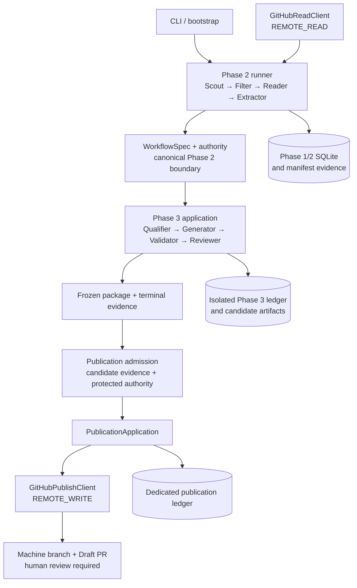

<!-- generated-by: gsd-doc-writer -->
<!-- GSD:DOC generated -->

# SkillScout Architecture

## System overview

SkillScout is a modular, resumable pipeline that turns a bounded, read-only view of a public GitHub repository into an evidence-backed Agent Skill candidate and, only after deterministic qualification, validation, and an independent semantic review, may create or update a Draft Pull Request in a controlled catalog. The implementation follows a domain/application/adapter structure: immutable Pydantic contracts and pure policy live in `src/skillscout/domain/`, orchestration lives in `src/skillscout/application/`, concrete GitHub, semantic-provider, filesystem, validator, and SQLite integrations live in `src/skillscout/adapters/`, and `src/skillscout/bootstrap.py` plus `src/skillscout/cli.py` are the composition and command boundaries.

The normal path never clones a source repository, installs its dependencies, imports its modules, or executes its scripts. Remote source access is through a closed GitHub REST read adapter; repository bytes are treated as untrusted data. Publication is a separate authority-bearing subsystem whose terminal automated action is a Draft PR and reviewer request. No production interface exposes merge, approval, review submission, ready-for-review, default-branch mutation, or arbitrary HTTP operations.

## Component diagram



The diagram shows authority direction, not a single in-memory call graph. Phase 2 state is reopened through a read-only verifier before Phase 3, and publication re-reads durable Phase 2/3 evidence before protected catalog authority or a write token is introduced.

## Pipeline and data flow

1. `skillscout extract-repo` loads a strict repository subject and builds the Phase 2 runtime. `Scout` reads repository metadata, resolves a ref to an exact 40-character commit SHA, and enumerates a bounded tree.
2. `Filter` applies a closed policy to public/private status, archived/fork/disabled state, default branch, root README presence, license-file ambiguity, and an allowlisted SPDX license confirmed at the pinned commit.
3. `Reader` admits only bounded paths and file types, rejects symlinks, submodules, binary/LFS and over-budget content, and reads files in deterministic tiers. It records file hashes and read order; it does not execute the content.
4. `Extractor` sends a delimited untrusted snapshot to a tool-less structured semantic request. Deterministic code then verifies every cited path, blob SHA, verbatim excerpt, content hash, and forbidden-text rule before constructing at most three canonical `WorkflowSpec` objects.
5. Phase 3 is started with `skillscout build-candidate` and a private canonical candidate descriptor. The application reopens completed Phase 2 state read-only, verifies its hash chain, binds the selected workflow fingerprint to a `WorkflowSpecAuthorityV1`, and derives a complete `CandidateExecutionAuthorityV1` before looking up reusable Phase 3 work.
6. The Phase 3 runner executes `Qualifier`, `Generator`, `Validator`, and `Reviewer` in order. Every successful transition is hash-linked and checkpointed. A rejection, refusal, incomplete semantic response, schema failure, validation error, or low-confidence/negative review produces a terminal local outcome without publication authority.
7. An eligible candidate is materialized as a frozen package plus canonical evidence such as the qualification report, package manifest, validation report, review attestation, and terminal summary.
8. `verify-publication-admission` re-derives candidate-only digests without protected catalog configuration. In the protected publication job, the same evidence is re-read and compared, catalog/reviewer authority is loaded, and a `PublicationAdmissionV1` is derived before token minting.
9. `publish-candidate` reconciles the configured catalog, machine branch, Draft PR marker, commit lineage, package tree, and reviewer evidence before any mutation. It creates or fast-forwards only the derived machine branch, creates or updates one Draft PR, requests configured individual reviewers, and verifies the resulting remote state.

The older `dry-run` command exercises a fixture profile over the complete `PipelineStage` spine, ending in a local `PublicationPlan` with status `planned_not_published`. It is not the controlled remote publisher. The implemented repository profile ends after the Phase 2 extractor, Phase 3 has its own four-stage ledger, and remote publication has a separate state machine.

## Stage contracts and the `WorkflowSpec` boundary

All persisted cross-stage objects use strict, frozen Pydantic models with unknown fields forbidden. Canonical JSON and SHA-256 digests bind identities, payloads, results, checkpoints, manifests, model/prompt/policy versions, retry policy, and source commit. Stage payloads also enforce limits on JSON depth, node count, collection size, key size, string size, integer range, and total manifest bytes.

`WorkflowSpec` is the main untrusted-content reduction boundary:

- Before the boundary, the reader holds bounded repository text and the extractor receives it as explicitly untrusted inert data.
- The model can propose workflows only through `ExtractorResponse`; it cannot call tools.
- Deterministic boundary validation requires citations to known fetched paths and exact blob SHAs, checks excerpts are verbatim, rejects forbidden URL/command/secret patterns, and derives the workflow fingerprint from normalized goal and ordered steps.
- The persisted `WorkflowSpec` carries structured workflow fields plus evidence references and content hashes. Raw repository bundles do not cross into Phase 3.
- A candidate descriptor names one exact Phase 2 run, extractor output, verified chain anchor, workflow fingerprint, and expected authority digest. Phase 3 re-resolves all of these against a query-only Phase 2 snapshot rather than trusting the descriptor alone.

This boundary is reinforced by `WorkflowSpecAuthorityV1` and `CandidateExecutionAuthorityV1`, which bind the selected workflow to the exact Phase 2 chain and to every relevant qualification, generation, validation, review, runtime, and retry-policy version.

## Trust boundaries and effect scopes

`EffectScope` is a closed vocabulary: `none`, `local_state`, `remote_read`, and `remote_write`. Adapters declare their own scope; callers cannot assign one.

| Boundary | Admitted effects | Main enforcement |
|---|---|---|
| Phase 1 fixture dry-run | `none`, `local_state` | `SideEffectPolicy.phase_one()` rejects remote scopes before invocation. |
| Phase 2 repository processing | `none`, `local_state`, `remote_read` | `SideEffectPolicy.phase_two()` and the closed `GitHubReadClient`/semantic adapter surfaces. |
| Phase 3 candidate processing | local state, bounded semantic `remote_read` | Lazy factories are invoked only after verified source and authority binding; no publication adapter is in this graph. |
| Candidate-to-publication handoff | no capability transfer | The handoff contains canonical locators and candidate digests only, never catalog authority, reviewer authority, or credentials. |
| Controlled publication | dedicated `remote_write` graph | Exact `PublicationAdmissionV1`, protected configuration, delayed token/client construction, a separate ledger, and `GitHubPublishClient`'s finite route surface. |

Semantic adapters use one configured provider profile. OpenAI requests use strict parsed response models, `store=False`, bounded tokens, and no tools. The alternative DeepSeek path accepts only the official configured base URL, disables thinking, requests one JSON object, and validates it strictly against the local Pydantic schema. Provider credentials are resolved only when constructing a client and are excluded from settings representations and persisted result models.

## Independent Reviewer context

The Reviewer is not a continuation of the Generator request. `OpenAIReviewClient.review()` creates a fresh semantic request with its own reviewer instructions and strict `ReviewerJudgment` response schema. Its user envelope contains exactly four canonical sections:

1. the verified `WorkflowSpec`;
2. rendered artifact files, excluding the generated provenance file from the artifact-file section;
3. package provenance as its own canonical section; and
4. the zero-error `ValidationReportV1`.

The Reviewer receives neither the raw repository snapshot nor generator conversation state. It is instructed to judge only, cannot use tools, and cannot return replacement files, patches, executable content, or publication authority. Its structured result is converted into a digest-bound `ReviewAttestationV1`. Publication admission additionally requires the terminal outcome `eligible_local_candidate`, successful qualification, zero validation errors, a `YES` verdict, and confidence of at least `0.8`.

## Durable state and evidence

State is split by authority and recovery purpose:

- `SQLiteStateStore` owns Phase 1/2 runs, attempts, results, checkpoints, and resume events. Results point to canonical manifest evidence in a sibling manifest directory. Startup, migration, manifest, and chain verification fail closed on disagreement.
- The same store has isolated `phase3_*` tables for candidate identities, attempts, results, checkpoints, resume events, artifacts, and terminal summaries. Phase 3 uses a separate stage sequence and verifies the complete successful prefix before reuse.
- `SQLitePhaseTwoCandidateSource` opens Phase 2 evidence from stable private files into an in-memory, query-only SQLite connection with a restrictive authorizer. It exposes projections, not a writable store.
- Candidate output is projected through anchored, no-symlink filesystem operations. Existing immutable evidence must match byte-for-byte; a conflicting projection fails instead of overwriting it.
- `PublicationStateStore` is deliberately separate from candidate state. It stores only canonical publication intent, a hash-linked checkpoint vocabulary, bounded remote identifiers/SHAs, and the terminal publication record. It does not admit tokens, headers, provider bodies, exceptions, or candidate prose.

The resumability rule is “verify, then reuse”: completed or partial chains are never trusted by row presence alone. The code revalidates canonical bytes, authority digests, stage order, predecessor hashes, output hashes, checkpoint continuity, and terminal evidence before continuing.

## Publication isolation

Publication is split into three layers:

- `skillscout.domain.publication` is pure and has no network, filesystem, provider, or credential imports. It turns eligible candidate evidence plus protected catalog/reviewer configuration into deterministic intent and admission identities.
- `PublicationApplication` sequences reconciliation and mutation. Ambiguous, markerless, cross-catalog, human-modified, wrong-base/head, reviewer-evidence, or lineage states return `manual_intervention_required`.
- `GitHubPublishClient` is construction-bound to one catalog and stable slug. It exposes bounded Git Data, machine-ref, Draft PR, and individual-reviewer operations only. Ref updates are non-force, PRs remain drafts, and writes are confined to `skills/{stable_slug}/`.

The GitHub Actions workflow preserves the same split. Its unprivileged `admit` job has repository read permission and emits only three locators plus seven candidate digests. The protected `publish` job revalidates those values, derives authority-bound admission locally, then mints a catalog-scoped GitHub App installation token and invokes the closed publisher. Third-party actions are pinned to full commit SHAs, checkout credentials are not persisted, and no third-party action runs after token creation.

## Current Phase 4 boundary

The repository currently implements the controlled-publication code path and a protected, manually dispatched workflow:

- canonical publication evidence, intent, admission, marker, and record contracts;
- a separate crash-recovery ledger;
- finite GitHub REST read/write operations for machine commits, non-force refs, Draft PRs, and individual reviewer requests;
- reconcile-before-mutate behavior and manual-intervention outcomes;
- static workflow, supply-chain audit, transport, recovery, secret-canary, and negative-capability tests.

The current production workflow is `workflow_dispatch` only. Its `live_canary` input is explicitly reserved and “never runs remotely here”; the live canary implementation is test-only and requires complete, explicit opt-in configuration. Consequently, repository code proves the bounded production surface and provides a canary harness, but it does not by itself prove a successful run against a real protected catalog, active ruleset, or installation.

Later operational and acceptance work is not part of the implemented runtime:

- There is no scheduled GitHub Search ingestion path, daily query set, 100-candidate/20-semantic-candidate production scheduler, shared production concurrency group, or durable state-branch synchronization. Those belong to the Phase 5 boundary.
- There is no repository-contained five-real-repository acceptance run, completed adversarial MVP report, or automatically executed live permission canary. Those belong to the Phase 6 acceptance boundary.

These omissions do not weaken the present safety rule: the implemented system never auto-merges and never executes untrusted repository code.

## Key abstractions

| Abstraction | Location | Responsibility |
|---|---|---|
| `StagePayload`, `StageInput`, `StageEnvelope`, `VerifiedRunChain` | `src/skillscout/domain/models.py` | Closed Phase 1/2 stage data and verified ledger chain. |
| `WorkflowSpec` | `src/skillscout/domain/extraction.py` | Evidence-backed structured boundary between untrusted repository reading and downstream candidate processing. |
| `WorkflowSpecAuthorityV1`, `CandidateExecutionAuthorityV1` | `src/skillscout/domain/candidate_authority.py` | Bind Phase 2 evidence, selected workflow, and all Phase 3 policy/runtime identities. |
| `PipelineRunner` and `SideEffectPolicy` | `src/skillscout/application/pipeline.py` | Ordered/resumable Phase 1/2 execution and composition-time effect admission. |
| `PhaseTwoProcessor` | `src/skillscout/application/processors.py` | Deterministic Scout/Filter/Reader dispatch and bounded Extractor integration. |
| `PhaseThreeApplication` and `PhaseThreeRunner` | `src/skillscout/application/phase3.py` | Completed-first candidate reuse and the qualifier/generator/validator/reviewer cascade. |
| `FrozenSkillPackageV1` | `src/skillscout/domain/skill_artifacts.py` | Canonical rendered files, manifest, provenance, and package identity. |
| `ValidationReportV1` | `src/skillscout/domain/validation.py` | Bind official validation and deterministic local structure/safety findings to one package. |
| `ReviewAttestationV1`, `CandidateTerminalSummaryV1` | `src/skillscout/domain/review.py` | Independent review evidence and the terminal eligibility decision. |
| `PublicationAdmissionV1` | `src/skillscout/domain/publication.py` | Exact composition of candidate evidence and protected catalog/reviewer authority. |
| `PublicationApplication` | `src/skillscout/application/publication.py` | Reconcile-before-mutate Draft publication state machine. |
| `SQLiteStateStore`, `PublicationStateStore` | `src/skillscout/adapters/state.py`, `src/skillscout/adapters/publication_state.py` | Authority-separated durable ledgers and recovery evidence. |

## Directory structure rationale

```text
src/skillscout/
├── domain/       # Pure immutable contracts, canonical identities, and deterministic policy
├── application/  # Stage orchestration, authority sequencing, and ports
├── adapters/     # GitHub, semantic provider, validator, filesystem, and SQLite implementations
├── bootstrap.py  # Composition roots and protected publication configuration
└── cli.py        # Packaged command and local projection boundary

config/
└── supply-chain/ # Pinned Phase 3 validator trust material used by deterministic gates

tools/            # Dependency-light offline evidence and acceptance verifiers
tests/            # Contract, transport, recovery, injection, security, and workflow tests
.github/workflows/
└── publish-candidate.yml # Protected manual Draft publication workflow
```

The directory split keeps deterministic domain decisions independent of I/O, makes effectful capabilities explicit at composition time, and allows tests to substitute transports and state seams without widening production interfaces. Publication-specific domain, application, adapter, state, and workflow files remain separate from the read-only discovery path so remote-write authority cannot leak into routine repository analysis.
